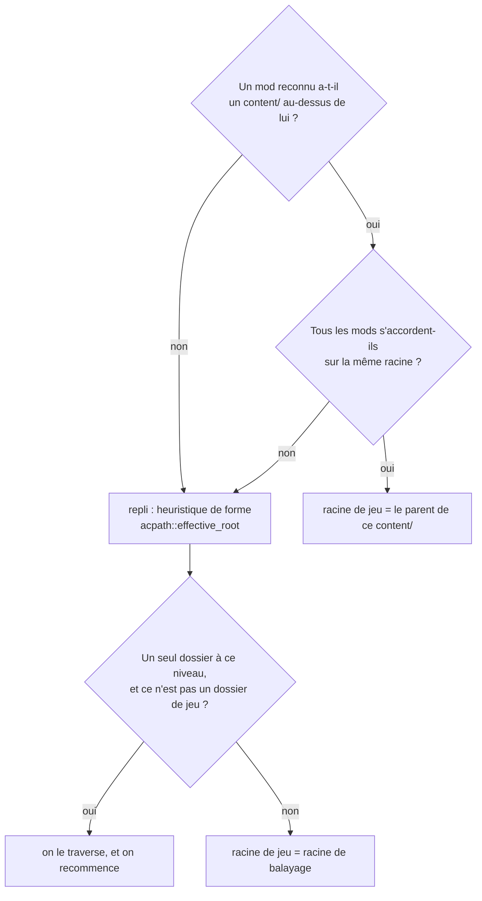
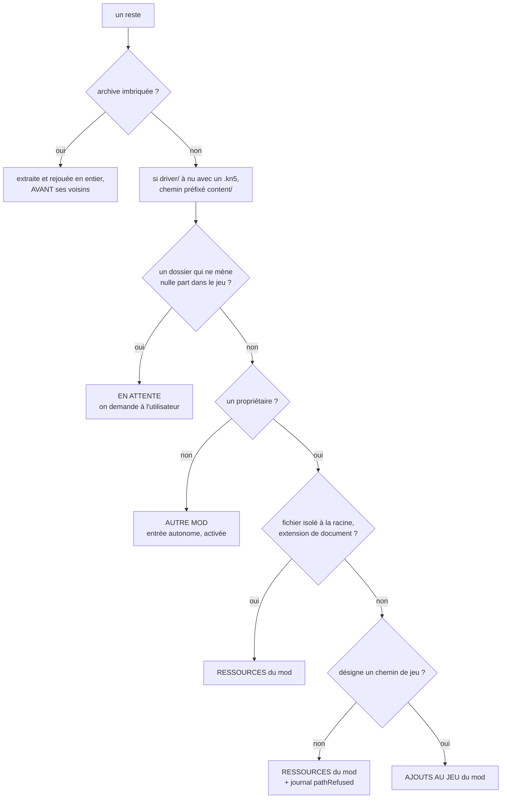

# Import — arbre de décision et mécanismes de pose

Ce document ne remplace pas `SPEC.md` §4 : il le **rend vérifiable**. Les règles
d'import y sont décrites en prose sur deux cents lignes, chacune juste, mais
impossibles à embrasser d'un coup d'œil. C'est comme ça que `mods/` a pu figurer
pendant des mois dans la liste des dossiers qu'Assetto Corsa lit — personne ne
pouvait voir la liste et ses conséquences en même temps.

Ici : une seule question, un seul arbre, une seule table de destinations. Quand
`SPEC.md` et ce document divergent, **`SPEC.md` fait foi** — mais alors l'un des
deux est à corriger tout de suite.

---

## 1. La question unique

Tout le pipeline répond à **une seule question, posée fichier par fichier** :

> **Où va ceci ?**

Les cinq destinations possibles, et rien d'autre :

| Destination | Ce que ça veut dire |
| --- | --- |
| **Bibliothèque, contenu du mod** | ça part dans `content/<type>/<id>` quand le mod est actif |
| **Bibliothèque, ressources** | documentation, templates — **jamais** dans le jeu |
| **Bibliothèque, ajouts au jeu** | posé ailleurs dans l'install AC, avec le mod |
| **Bibliothèque, en attente** | on ne sait pas, on demande à l'utilisateur |
| **Laissé dans la source** | mode « Aucun » de l'extraction des annexes, uniquement |

Rien n'est jamais supprimé sans une réponse explicite de l'utilisateur.

---

## 2. Phase 1 — reconnaissance

Trois balayages **indépendants et disjoints** sur tout l'arbre extrait. Un
dossier reconnu n'est jamais exploré plus profond.

| Balayage | Signal cherché | Produit |
| --- | --- | --- |
| `modscan::scan` | `ui/ui_car.json` · `ui/ui_track.json` (y compris dans un sous-dossier de layout) | voiture · circuit |
| `modscan::scan_subs` | `<x>/skins/<skin>` · `skins/<voiture>/<skin>` · `skins/cm_skins/<skin>` · `GUIDs.txt` + `*.bank` | pack de skins · mod de son |
| `modscan::scan_apps` | `<Nom>/<Nom>.py` · `<Nom>/<Nom>.lua` | app |

**Un filtre après coup** : un pack de skins dont la voiture cible est inconnue
**et** dont les livrées portent les noms de celles d'un contenu de la même
source n'est pas un pack, c'est une **variante** — il n'est pas consommé
(`pending::offered_liveries_target`). Sans ce recoupement de noms, un pack pour
une voiture pas encore installée resterait un pack, ce qui est légitime.

**Si les trois sont vides** : on descend dans les archives imbriquées avant de
conclure. Rien de reconnu à la racine ne veut pas dire rien du tout — beaucoup
d'auteurs livrent un `readme.txt` et un `.zip`. Sans archive imbriquée, toute la
source devient un « autre mod ».

---

## 3. Phase 2 — les deux racines

Le balayage des restes tient **deux racines**, et il faut les deux :

- **racine de balayage** — ce qu'on parcourt pour ne rien laisser derrière. Elle
  ne bouge jamais, sinon un fichier posé à côté de l'emballage de l'auteur ne
  serait jamais ramassé.
- **racine de jeu** — celle à laquelle les chemins sont relatifs pour AC. Elle
  se **déduit** de l'endroit où les mods ont été trouvés : un mod à
  `<X>/content/cars/<id>` établit que `<X>` est cette racine.

Un reste **hors** de la racine de jeu voit son chemin compté depuis la racine de
balayage : il ne mènera donc nulle part dans AC, ce qui est exactement ce qu'on
veut dire de lui.

*Les avoir confondues a coûté deux bugs opposés : la font d'un mod VRC jamais
posée (l'emballage `AC Files/` restait dans le chemin), et le patch de LA Canyons
posé dans un `<AC>\MODS\` que le jeu ne lit pas.*

---

## 4. Phase 3 — l'arbre de décision d'un reste

Un « reste » est tout ce qui, après la phase 1, n'est ni un dossier reconnu ni
dedans. Les tests s'appliquent **dans cet ordre** — le premier qui répond
gagne.

**Le propriétaire**, dans cet ordre :

1. le chemin contient l'id d'exactement **un** mod reconnu de la source ;
2. sinon, la source ne livre qu'**un seul** mod, et tout ce qui l'entoure lui
   appartient ;
3. sinon, elle en livre **plusieurs** : ils forment un pack (§4.4), et c'est le
   **pack** qui possède ce qui les entoure.

Voitures, circuits **et** apps comptent — pas les packs de skins ni les sons,
dont le parent n'est pas forcément dans cette source.

*La troisième règle a remplacé un trou.* « Dans un pack multi-mods, un reste que
rien ne rattache reste un autre mod » se lisait comme un compromis ; c'en était
un jusqu'à ce qu'on mesure sa portée. Une voiture livrée avec sa variante CSP
est la forme la plus banale qui soit, et **plus rien** n'y était rattaché : les
notices devenaient des entrées inertes, et `content/fonts` une entrée anonyme
survivant à la suppression des deux voitures.

**Les archives imbriquées passent avant leurs voisins** : ce qui en sort entre
dans la liste des propriétaires possibles. C'est ce qui range la notice livrée à
côté d'un `Car.zip` dans les ressources de la voiture qui en sort.

**Un composant optionnel** — archive imbriquée **et** qui remplace des fichiers
du jeu de base — est rangé mais laissé inactif, et la question est posée en fin
de lot. Les deux signaux sont exigés ensemble : une archive imbriquée porte
souvent le mod principal, et remplacer du jeu de base est le quotidien de mods
obligatoires (shaders, fonts).

---

## 5. Ce qu'un dossier en attente peut devenir

L'utilisateur tranche en fin de lot. Les réponses proposées dépendent du
dossier — **« ajouter au jeu » et « ajouter au dossier du mod » s'excluent**,
selon qu'il porte ou non un arbre de jeu.

| Réponse | Où ça va | Comment on revient dessus |
| --- | --- | --- |
| **Ajouter au jeu** | ajouts au jeu du propriétaire | retiré à la désactivation du mod |
| **Ajouter au dossier du mod** | couche composée par-dessus la version | « Couches & extensions » sur la fiche |
| **Garder sans installer** | ressources du propriétaire | rien à défaire |
| **Garder à part** | entrée « autre mod » | écran « Autres mods » |
| **Ne pas importer** | supprimé, journalisé `userDiscarded` | l'archive source, si conservée |

**« Ajouter au dossier du mod » n'apparaît que pour une variante de livrées** —
le seul cas où on sait *où* les fichiers vont dedans, la structure `skins/<nom>`
et le recoupement des noms le prouvant. Ailleurs, la destination n'est écrite
que dans la notice de l'auteur : composer à l'aveugle poserait les fichiers au
mauvais endroit, en silence. La notice est affichée au moment du choix, donc
l'utilisateur peut le faire lui-même en connaissance de cause.

Aucune réponse n'est pré-cochée quand le dossier remplace des fichiers du jeu de
base : aucun des deux défauts n'est sûr, donc l'app ne fait pas semblant de
savoir.

---

## 6. Phase 4 — les mécanismes de pose

Sept destinations dans l'install AC, et elles ne se posent pas de la même façon.
C'est cette table qu'il faut avoir en tête pour comprendre ce que fait une
activation.

| Ce qui est posé | Où | Comment | Retiré quand |
| --- | --- | --- | --- |
| Voiture · circuit (+ ses couches) | `content/cars\|tracks/<id>` | hardlinks, arbre composé base + couches | désactivation, suppression |
| Ajout au jeu **d'un pack** | n'importe où sous la racine AC | hardlink fichier par fichier | plus **aucun membre** du pack n'est actif |
| Skin de voiture | `content/cars/<voiture>/skins/<skin>` | junction | suppression du skin |
| Skin de circuit | `content/tracks/<circuit>/skins/cm_skins/<skin>` | junction | suppression du skin |
| Son de voiture | `content/cars/<voiture>/sfx/` | **remplacement du contenu**, original sauvegardé | restauration, un seul son actif |
| App | `apps/python\|lua/<id>` | junction | désactivation, suppression |
| Ajout au jeu | n'importe où sous la racine AC | hardlink **fichier par fichier** | plus aucun mod ne réclame le chemin |
| Autre mod | idem | junction au plus haut niveau libre, lien fichier sinon | désactivation |

**Pourquoi les ajouts au jeu ne sont pas jonctionnés** : plusieurs mods visent
les mêmes arbres (`extension/textures/common/rss/…` est livré à l'identique par
chaque voiture RSS), et une jonction de dossier en donnerait la propriété
exclusive au premier arrivé.

**Trois garde-fous absolus**, jamais contournables :

1. jamais de junction ni de suppression sur un **vrai dossier** de `content/` ;
2. jamais d'écriture dans le dossier du jeu sans passer par `gamebackup` ;
3. on ne retire que ce qu'on a posé, et seulement si c'est **encore** là.

---

## 7. Quand la place est déjà prise

Deux mécanismes posent des fichiers isolés — les ajouts au jeu et les mods
« autres ». Les deux suivent les mêmes règles.

| Situation | Ce qui se passe |
| --- | --- |
| Un autre mod réclame le chemin | fichier partagé : on s'ajoute, l'arbitrage par date tranche |
| On l'a déjà remplacé | l'original est à l'abri, même arbitrage |
| Fichier du jeu intact, exemplaire **plus récent** | remplacé, après sauvegarde de l'original |
| Fichier du jeu intact, exemplaire **plus ancien ou de même date** | **laissé en place**, le nôtre attend |
| Fichier du jeu intact, **autorisation explicite** | remplacé quand même, après sauvegarde |
| Plus aucun réclamant | l'original revient, ou le fichier part |

**L'arbitrage par date protège les poses automatiques, pas les décisions.**
Quand l'utilisateur vient de répondre « ajouter au jeu » devant l'avertissement
qui lui disait combien de fichiers du jeu seraient remplacés, la date n'a plus
autorité : les chemins autorisés sont mémorisés (`forced_extras`) et la
comparaison est levée pour eux. La **sauvegarde reste obligatoire** — c'est elle
qui rend l'opération sûre, pas la date.

---

## 8. Décider seul, ou demander

Le critère, et il ne bouge pas : **demander seulement quand l'information est
dans la tête de l'utilisateur, pas sur le disque.**

| Cas | Réponse | Pourquoi |
| --- | --- | --- |
| `driver/` avec un `.kn5` | décide | déterminable, et il y a une bonne réponse |
| Emballage de l'auteur | décide | déterminable depuis les mods trouvés |
| Fichier partagé entre deux mods | décide | la date tranche, et se rejoue |
| Deux versions du même mod | demande | intention |
| Variante offerte par l'auteur | demande | intention |
| Composant qui remplace le jeu de base | demande | aucun défaut n'est sûr |

Deux contraintes encadrent toute question : **jamais de blocage en import de
masse**, et **arbitrage groupé en fin de lot**. Ce qui a coûté cher n'a jamais
été un défaut mal choisi — c'est un défaut appliqué **en silence**.

---

## 9. Les archives de référence

Cinq archives réelles, chacune tombée sur un défaut différent. Elles sont la
matière des tests d'import : toute règle qui change doit être rejouée contre
elles.

| Archive | Ce qu'elle a révélé | Ce qui se passe aujourd'hui |
| --- | --- | --- |
| **Ferrari F2002 V1.4** | `2K Skins/` et `No Dust Skins/` importés comme skins d'une voiture qui n'existe pas | reconnus comme livrées de remplacement, mis en attente, posables en couche |
| **VRC Pageau 9T8** | emballage `AC Files/` accompagné → `content/fonts` jamais posé ; puis **deux** voitures → plus rien n'était rattaché | racine de jeu déduite ; tout appartient au pack, dont les deux notices lisibles depuis les deux fiches ; wallpapers et templates en attente |
| **Ferrari 599 GTO** | `driver/` livré à nu à côté de la voiture | préfixé `content/driver/` sans rien demander, décision journalisée |
| **_RSS_Settings** | notice d'une app devenue un « autre mod » à nom absurde, dossier introuvable | l'app est propriétaire : la notice est sa ressource, lisible sur sa fiche |
| **LA Canyons 1.2** | `MODS/<variante>/` posé dans un `<AC>\MODS\` inerte | `mods/` n'est plus un dossier de jeu ; les variantes se choisissent |

---

## 10. Où est le code

| Question | Fichier |
| --- | --- |
| Qu'est-ce qu'un chemin de jeu ? | `acpath.rs` |
| Qu'est-ce qui est reconnu ? | `modscan.rs` |
| Orchestration, balayage des restes | `importer.rs` |
| Annexes, extraction, prévisualisation | `resources.rs` |
| Ajouts au jeu, arbitrage, réclamations | `extras.rs` |
| Dossiers proposés, détection, résolution | `pending.rs` |
| Mods « autres » | `others.rs` |
| Sauvegarde des fichiers du jeu | `gamebackup.rs` |
| Composition base + couches | `compose.rs`, `deploy.rs`, `layers.rs` |
| Junctions, hardlinks, garde-fous | `activation.rs` |
